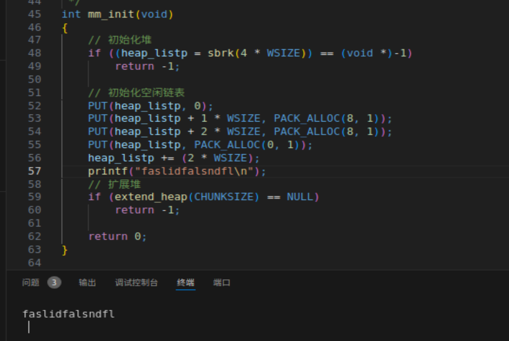
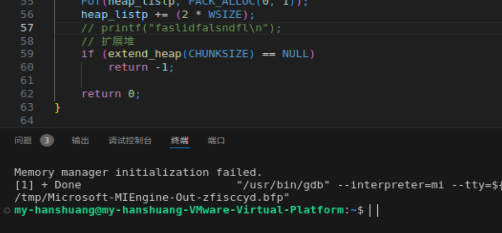
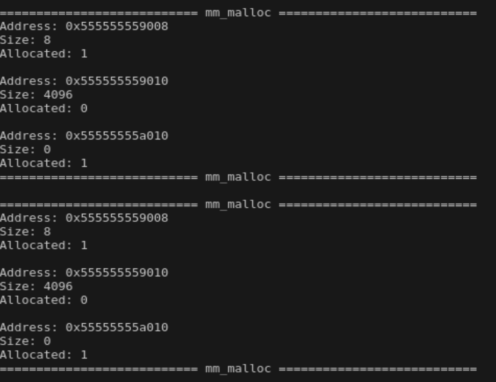
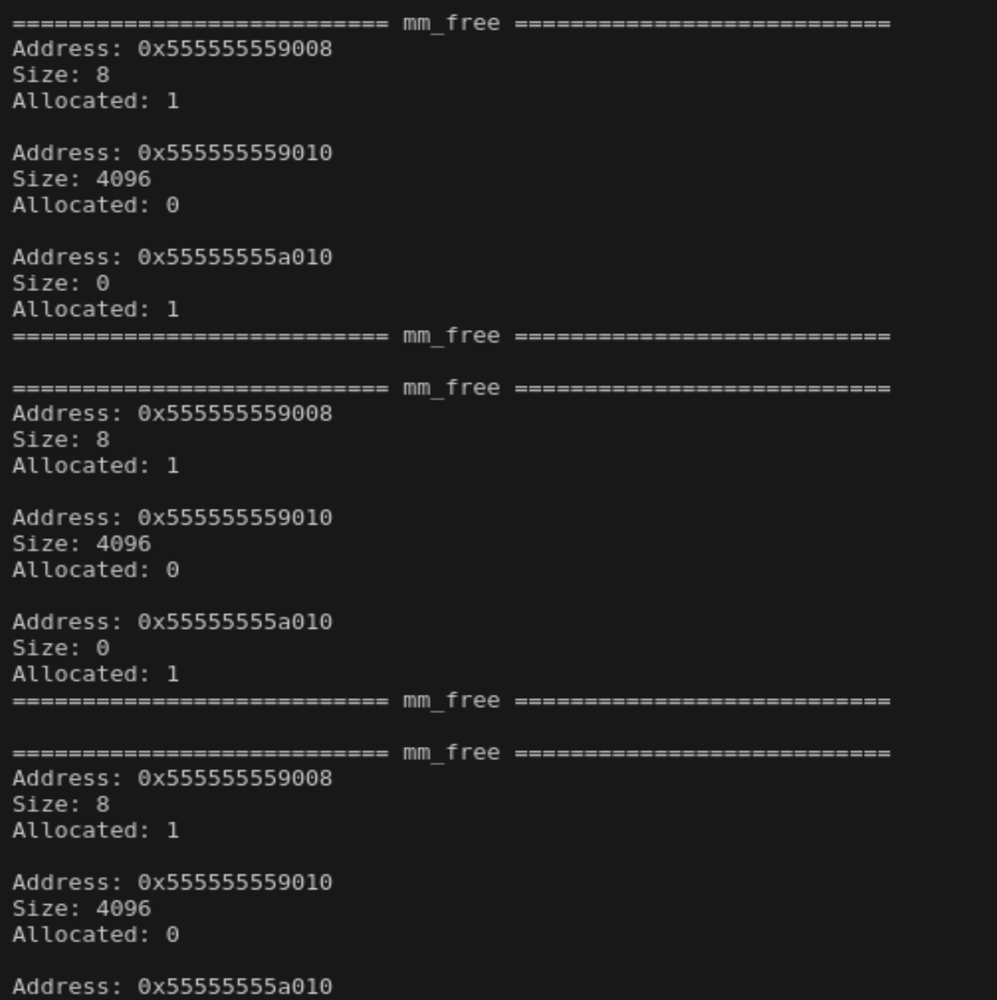
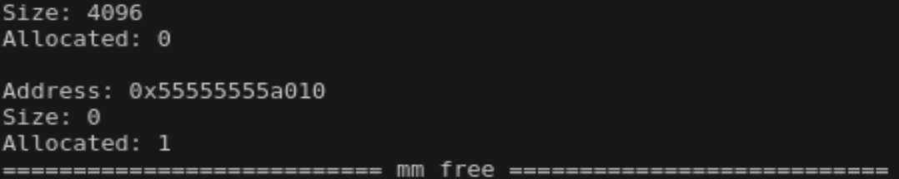

## 2024090904002-胡杨-CS-07

做不动了www

### Part0 项目前置知识
overview


#### 虚拟内存

**从高向低可以分为：临时映射、固定映射、永久映射、vmalloc、normal 映射、dma 映射等区。**

- 临时映射区

  - 为了让内核能够摸到某块不定的物理区域而专门预留的区域，每次使用后擦除。用于应对内核里不允许操作物理地址的限制。
  - 例如页表管理、物理内存管理等操作。
  - 比如从 page cache 内取出 page，此时它是物理地址，但是内核里不允许直接操作物理地址，因此将此区和物理地址建立映射，再通过对虚拟地址进行操作从而绕过马奇诺防线曲线救国（为了虚拟内存方便牺牲的一点便利

- 固定映射区

  - 字如其名，用于固定映射一块物理内存（一页）。其在编译的时候就已经确定。（也就是说对每个进程都不一样）
  - 上下文切换的时候不会被踢出告诉缓存，访问速度快

- 永久映射区

  - 用于对高端物理内存（896 ~ END）建立映射。它实质上是虚拟空间与物理地址无法一一映射的一个 solution。
  - 它映射着一份页表，页表中记录着对应关系，这个区域在内核启动时就被写入，直到内核停工才解除。当然也可以手动进行更改。
  - 当永久映射区满，又要访问高端内存，会选择：挂起访问请求的进程、临时蹭一下临时映射区、vmalloc 三者之一。

- vmalloc 

  - 用于分配虚拟内存中连续、但物理地址不连续的区域。
  - *注意！此处是内核！！！一般来说内核很早就基本把要用的空间申请完了，那时候基本都是连续的，因此此处可以认为是一个容许后续操作的功能模块。

- 直接映射区：NORMAL + DMA（对物理内存的划分）

  - 很简单，虚拟地址减去 3G 就是物理地址。其中前 16M 专门交给 DMA。	

  > **DMA，全称Direct Memory Access，即直接存储器访问。**
  >
  > **DMA传输将数据从一个地址空间复制到另一个地址空间，提供在外设和存储器之间或者存储器和存储器之间的高速数据传输**。

- 栈：用于存储局部变量。
- 文件映射：用于装动态链接库等。
- 堆：手动申请内存在这里。
- BSS：未初始化的全局变量。
- 数据：已经初始化且初值不为 0 的全局变量和静态局部变量。
- 代码：存放机器指令和常量。

**不得不提一句，原图中“与进程相关的数据结构”存放的位置是直接映射区，便于对进程进行管理（好难查）**

#### 物理内存 & 虚拟内存

为了保证安全和防止两个程序同时使用一个地址导致出现不可预知的错误，程序都不得直接访问物理内存，而是通过操作虚拟内存间接操作物理内存。虚拟内存是一种映射，是操作物理内存的工具。

采用了一种类似“欺骗”的方法，变相地提升了内存容量。（内存不足时闲置线程丢到到磁盘里）

#### 动态内存分配器

##### 显式分配器和隐式分配器

二者都要求应用显式地分配块，区别只在于由谁来进行释放工作。

显式分配器要求应用本身显示地释放任何已分配的块。例如 C 中的 free 和 C ++ 中的 delete 的效果

隐式分配器则是由分配器去检测一个已分配块什么时候不再被使用。也因此叫做垃圾收集器。

##### 有效载荷

指的是分配的空间里，实际上用于存储数据的部分。

> 聚集有效载荷：所有已经分配的有效载荷之和

##### 内部碎片和外部碎片

当有效载荷小于等于分配的块的大小的时候，就称其产生了内部碎片

- 几乎必然产生，用于维护数据结构、地址对齐等作用。

当物理内存的多个部分加起来足够满足内存分配需求，但是没有一个连续的块能满足请求的时候，称产生了外部碎片。

##### 吞吐量和内存利用率

吞吐量：单位时间内内存分配器能处理的内存分配和释放请求的数量。

内存利用率：分配内存过程中，分配器可以有效使用的内存大小与总内存大小的比值。

#### 解决前言的问题

malloc 通过**调用系统的 mmap || brk 函数**向**堆**区申请内存扩展，申请的内存往往略大于原本设定的大小，在申请的内存块前**加上一些辅助信息**，便于 free 获取信息准确释放空间。

### Part1 从隐式空闲链表看起

读代码！（转战 VScode）

笔记（水）


```c
void *sbrk(intptr_t increment);//intptr_t 是指针地址类型的数据结构
```

函数作用：将堆的末尾指针移动 increment 个**字节**，返回上次调用 sbrk/brk 的内存末尾指针。调用失败返回 (void*) -1 。


```c
PACK(A,B);
```

其实这个东西在宏定义里面，意思是将两个字合并成一个字。在这里的作用是将块的大小和是否使用的两个数据合并到一起。

（但是宏定义不是 PACK_ALLOC 吗为什么啊（））

代码（具体是 coalesce 函数里）中说见图的贴在这里了（）


~~我的妈呀我爱死这份代码了，读起来真的可太轻松了，解耦做的太好了真的，还尤其是宏定义省了太多事了我感谢死了~~

有个小小的问题啊，find_fit 那个“够大就再重新分配出一个空块”到底什么是够大（

（很小很小也要吗（开销与实际利用似乎不太匹配？

~~只是一些胡言乱语罢了~~

现在 debug 遇到了一个挺奇怪的问题就是说

在有 printf 的时候它就水灵灵地卡住了，怎么整都不整明白……

来不及了我只能保证程序能跑了没时间验证对不对了辛苦学长了（磕头）

主要的思维也全部都丢进代码的注释了，没时间整理果咩……

结果如下：







